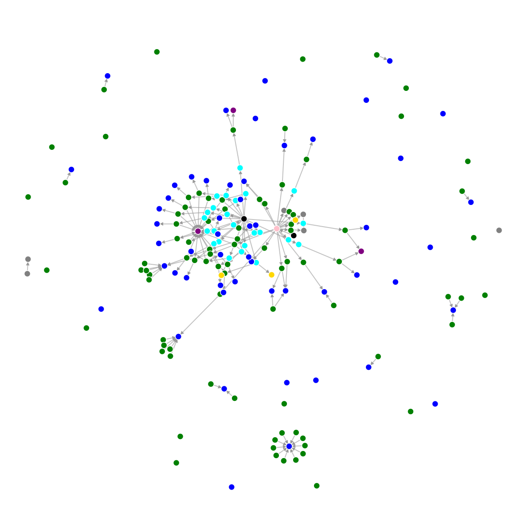

unity-asset-graph
==================

Track and visualize dependencies between Unity assets



Setup
------

```
npm install
npm run build
```

Generate database
------------------

```
npm start extract <path_to_unity_project> <path_to_output_file>
```

Visualize database
-------------------

```
npm start visualize <path_to_database_file> <path_to_output_html>
```
